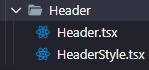

# florescer-front-end

## 🐱 Github:

1. Primeiro faça clone do repositório

```bash
git clone linkdorepositorio
```

2. Atribua uma tarefa a você no [Jira](https://florescer.atlassian.net/jira/software/projects/FLC/boards/1), depois copie a branch que o jira disponibiliza

```bash
git checkout -b nomeDaBranchDoJira
```

3. Faça sua tarefa e commits

```bash
git commit -m "descreva brevemente o que foi feito"
```

4. Depois de finalizada sua tarefa faça um push

```bash
git push
```

5.  Agora abra seu github no navegador e vá até o repositório do florescer e peça um pull request e aguarda as correções ou merge.

6.  Depois que sua tarefa for aprovada e mergeada você pode pegar uma nova tarefa. Mas antes de criar uma nova branch lembre-se:

```bash
git checkout main

git pull

git checkout -b nomeDaBranchDoJira
```

## 🛠️ Preparando o ambiente:

1. 🔮 Primeiro instale as dependencias do projeto:

```bash
npm install
```

2. 🚧 Depois inicie o projeto com o comando:

```bash
npm start
```

## ⚠️ Boas práticas:

- Ao criar uma nova página, container ou component lembrar de nomear em inglês e escrever em PascalCase como imagem abaixo, além de pensar em nomes que façam sentido, para ser de fácil entendimento.



- Usaremos os ícones do [ReactIcons](https://react-icons.github.io/react-icons/) já instalado em nosso package.json, nesse mesmo link mostra como é feita a utilização.
